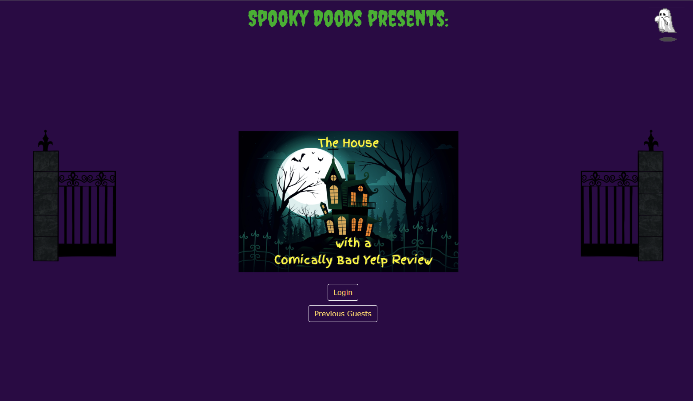
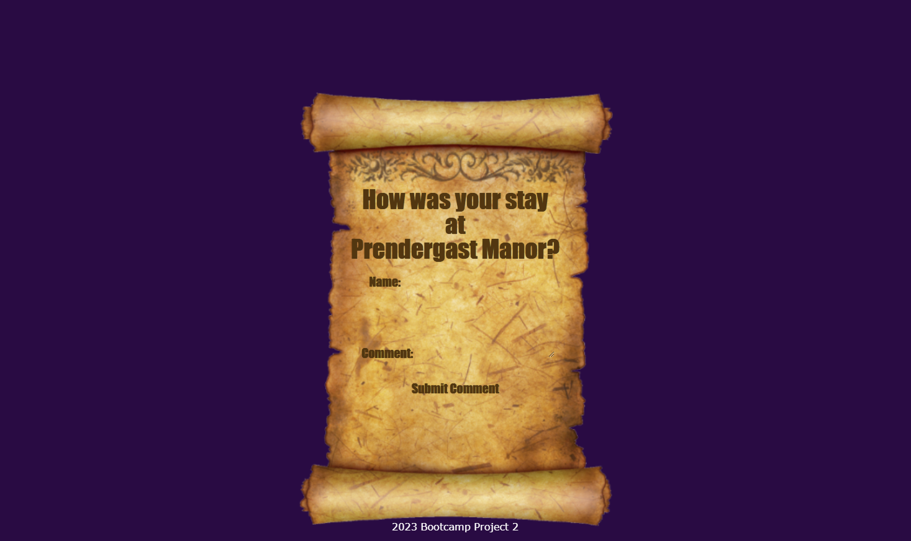

# THE HOUSE WITH THE COMICALLY BAD YELP REVIEW

This site is for users who enjoy nostalgic horror stories with a modern twist. "The House with the Comically Bad Yelp Review" creates an immersive experience where users can put their intuition to the test and see if they would survive a night in a haunted house. Features include animation, a login/signup page, a comments section, and a spooky animated ghost "home button".

- [Usage](#usage)
- [Development](#development)
- [Sessions](#sessions)
- [Technologies Used](#technologies-used)
- [Contributors](#contributors)
- [Deploy to Heroku](#deploy-to-heroku)

## Usage

The homepage of this site should appear as so:

Selecting the login button will route users to the login page. If they don't have any login information saved, they have the option to click the signup link. If users don't log in, they won't have access to the story or the comments page.

The signup page will appear as so:

Once users are logged in, they will be able to read the story. When the story is over, they have the option to leave a comment in the comments page.

## Development
Click [here](https://github.com/sadiemantlo/spooky-dudes) to view this site's repository.

[click this link to view this project's proposal](https://docs.google.com/document/d/1ewPnESOPCw304MIXz6Bu2y17ucfuHVgr6pkjIWyUSzs/edit#heading=h.kpv7qq2z2hft)

## Technologies Used

[Handlebars.js](https://handlebarsjs.com/) and [express-handlebars](https://www.npmjs.com/package/express-handlebars) are used for rendering templates.

[Anime.js](https://animejs.com/) was used for app animations

Sequelize was used for modelling the database.

Bootstrap was used for frontend design features

Bcrypt was used for encrypting sensitive user information

## Contributors

this site was created and developed by four of the coolest horror story nerds in the world:
[Eugene Calm](https://github.com/ecalmrd)
[Sasha Doval](https://github.com/sdoval27)
[Sadie Mantlo](https://github.com/sadiemantlo)
[Sinclair Li](https://github.com/AForkintheCode)

## Deploy to Heroku
Deployed site link [here](https://spooky-dudes.herokuapp.com/)

**IMPORTANT:** Payment info. must be provided in order to use the JawsDB MySQL
add-on. You must provide a credit card to use the service. **With the exception that all of you must be using the student package**

1. Create a Heroku app in the command line. `heroku create <optionally-provide an app name>`

2. Provision the [JawsDB MySQL add-on](https://elements.heroku.com/addons/jawsdb) with the free pricing plan. `heroku addons:create jawsdb:kitefin`

3. Add environmental variables to the heroku config. The boilerplate uses
   `SECRET` to sign the session id cookie. Use a tool to generate a long
   randomized string for this value. (e.g. `hsKVlvYcC5b#Fw1FS*qz`) Add `SECRET`
   to config by running `heroku config:set SECRET=<your long random secret>`.

4. Use the same command to add any other environmental variables required for
   your app to function. (`heroku config:set <name>=<value>`)

5. Deploy the app by running `git push heroku main`. (Use the command again to deploy updates.)

6. Open your app in the browser with `heroku open`.

### Seed JawsDB

Running `heroku run npm run seed` will run the seed script in Heroku if your
seeds are required for production.
